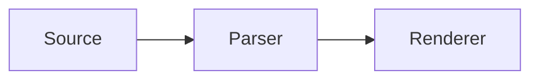

# AFM examples

Generated from src/examples.ts. Live examples use the reference TypeScript renderer.

## A work trace

Nested tool calls, patches, commands, and live activity.

````markdown
<details open data-afm-type="activity" data-afm-state="running">
<summary>Improving streaming<time datetime="{{START}}" data-afm-format="elapsed"></time></summary>

- <details data-afm-kind="read" data-afm-state="completed">
  <summary>Read the renderer and tests</summary>

  [renderer.ts:42](file:///workspace/project/src/renderer.ts:42) · [renderer.test.ts](./tests/renderer.test.ts)

  ```sh
  rg -n 'displayPrefix|streaming' src/renderer.ts
  ```

  </details>
- <details open data-afm-kind="edit" data-afm-state="completed">
  <summary>Edited 2 files · +3 −2</summary>

  - [+] Buffer incomplete tags

      ```diff
      --- a/src/renderer.ts
      +++ b/src/renderer.ts
      @@ -12,3 +12,4 @@
       export function visible(source: string) {
      -  return source;
      +  const safe = completePrefix(source);
      +  return safe;
       }
      ```

      - [-] Activity labels

          ```diff
          --- a/src/activity.ts
          +++ b/src/activity.ts
          @@ -8,3 +8,3 @@
           export function label(state: State) {
          -  return "Working";
          +  return state === "completed" ? "Worked" : "Working";
           }
          ```

          - [-] Inspect the changes

              ```sh
              git diff --check
              git diff --stat
              ```

  </details>
- <details open data-afm-kind="agent" data-afm-state="running">
  <summary>Review agent<time datetime="{{START}}" data-afm-format="elapsed"></time></summary>

  [Open review](https://example.org/agents/review)

  - <details open data-afm-kind="execute" data-afm-state="running">
    <summary>Checking stream boundaries</summary>

    ```sh
    bun test tests/renderer.test.ts
    ```

    - [-] Latest output

        ```text
        PASS nested disclosures
        PASS literal code and diff boundaries
        Checking remaining stream partitions…
        ```

    </details>

  </details>

</details>

<footer>2 files changed · Review in progress</footer>
````

## Expandable activity rows

Each summary is the row. No repeated bullet label.

````markdown
<details open data-afm-type="activity" data-afm-state="running">
<summary>Working<time datetime="{{START}}" data-afm-format="elapsed"></time></summary>

- <details data-afm-type="activity" data-afm-kind="read" data-afm-state="completed">
  <summary>Read the project documentation</summary>

  The project uses Markdown and HTML.

  </details>
- <details open data-afm-type="activity" data-afm-kind="execute" data-afm-state="completed">
  <summary>Ran the tests</summary>

  ```text
  24 passed. No failures.
  ```

  </details>
- <details data-afm-type="activity" data-afm-kind="agent" data-afm-state="running">
  <summary>Research assistant is checking sources</summary>

  [Open subagent](https://example.org/agents/research)

  - [x] Read the grammar
  - [ ] Compare streaming behavior

  </details>

</details>
````

## Markdown disclosures

[-] collapsed; [+] expanded. Tasks remain tasks.

````markdown
- [-] Read files
    - README.md
    - [+] Run checks

        ```text
        24 passed.
        ```

        - [x] Tests
        - [ ] Review

> Short alias
    Indented content makes a disclosure.
````

## Timers

Wall elapsed, active, fixed duration, countdown.

````markdown
<span data-afm-type="activity" data-afm-state="running">Thinking<time datetime="{{START}}" data-afm-format="elapsed"></time></span>

<span data-afm-type="activity" data-afm-state="running">Working<time datetime="{{START}}" data-afm-format="active" data-afm-elapsed="90"></time></span>

<span data-afm-type="activity" data-afm-state="paused">Paused<time data-afm-format="active" data-afm-elapsed="107"></time></span>

Completed<time datetime="PT2M17S" data-afm-format="duration"></time>

Response window<time datetime="{{DEADLINE}}" data-afm-format="countdown"></time>
````

## Cards & vendor widgets

Expand a file to inspect its patch. Sample changes; no repository mutation.

````markdown
<section data-afm-type="card">

**[Web preview](https://example.org/report)**

Website

</section>

<section data-afm-type="example:changes">

**Edited 3 files**

3 additions · 3 deletions

<details open>
<summary>README\.md · +1 −1</summary>

```diff
--- a/README.md
+++ b/README.md
@@ -1 +1 @@
-# Agent Markdown
+# AFM: Agent Flavored Markdown
```

</details>
<details>
<summary>SPEC\.md · +1 −1</summary>

```diff
--- a/SPEC.md
+++ b/SPEC.md
@@ -1 +1 @@
-Render incomplete HTML immediately.
+Stream content after a complete HTML opening tag.
```

</details>
<details>
<summary>renderer.ts · +1 −1</summary>

```diff
--- a/renderer.ts
+++ b/renderer.ts
@@ -1 +1 @@
-render(source);
+render(displayPrefix(source));
```

</details>

<button type="button" data-afm-variant="primary" data-afm-action="demo:review">Review sample</button>

</section>
````

## Pick an answer

Choices, descriptions, and custom response belong to one fieldset.

````markdown
<form id="review-question" data-afm-action="demo:answer" data-afm-fallback="omit">
  <fieldset>
    <legend>What should we explore next?</legend>
    <label><input type="radio" name="topic" value="Activity" checked> Activity and timers</label>
    <label><input type="radio" name="topic" value="Cards"> Cards and artifacts
      <span>File reviews, previews, and attachments.</span>
    </label>
    <div>
      <label><input type="radio" name="topic" value="Custom"> Custom response</label>
      <textarea name="note" aria-label="Custom response" placeholder="Your answer…" rows="1"></textarea>
    </div>
  </fieldset>
  <button type="submit" data-afm-variant="primary">Send answer</button>
  <button type="reset" data-afm-variant="secondary">Reset</button>
</form>
````

## Direct choices

A row is an action; its second line is supporting text.

````markdown
<form data-afm-type="choices" data-afm-action="demo:choice">
<fieldset>
<legend>Connect an integration</legend>
<button type="submit" name="integration" value="notion">
<span>Notion</span><span>Store commitments in a database</span>
</button>
<button type="submit" name="integration" value="slack">
<span>Slack</span><span>Find promises in messages</span>
</button>
</fieldset>
</form>
````

## Citations and footer

Named footnotes and ordinary footer content.

````markdown
Disclosures can contain arbitrary flow content.[^html]
A source can support several statements.[^html]

<footer>

Prepared from the linked specification. Last checked September 15, 2026.

</footer>

[^html]: [HTML: the details element](https://html.spec.whatwg.org/multipage/interactive-elements.html#the-details-element). See the content model.
````

## The familiar vocabulary

Markdown first, with underline, highlight and spoilers. Code stays literal.

````markdown
**Bold** · *italic* · __underline__ · ~strike~ · ~~strike~~ · ==highlight==

The answer is ||a hidden detail||. H<sub>2</sub>O and x<sup>2</sup>.

> A useful standard keeps ordinary writing ordinary.

- [x] Markdown first
- [x] Optional vendor data
- [ ] Independent conformance testing

```ts
const literal = "__not underline inside code__";
```
````

## Diffs

Unified changes with line numbers and source context.

````markdown
```diff
--- a/renderer.ts
+++ b/renderer.ts
@@ -48,6 +48,7 @@
 export function render(source: string) {
-  const visible = waitForBlock(source);
+  const visible = projectStreamingSyntax(source);
   const tree = parse(visible);
+  preserveExpansion(tree);
   updateView(tree);
   return tree;
 }
```
````

## Math, all three ways

Inline and display dollar notation, plus a math fence. Typeset locally with KaTeX.

````markdown
Inline: $E = mc^2$.

$$\int_0^1 x^2\,dx = \frac{1}{3}$$

```math
\begin{pmatrix}1 & 0 \\ 0 & 1\end{pmatrix}
```

A literal price: \$20.
````

## Diagrams

Compact diagrams; only usable streaming revisions appear.

````markdown

````

## HTML preview lab

An isolated interface. Try its tabs and disclosure; no scripts or network.

````markdown
<iframe title="Review lab" sandbox>
<!doctype html>
<html lang="en">
<head><style>
body { font: 13px/1.6 system-ui; color: #333; margin: 16px; }
nav { display: flex; gap: 16px; border-bottom: 1px solid #ddd; padding-bottom: 8px; }
label { cursor: pointer; } input { accent-color: #666; }
article { padding-top: 12px; } p { margin: 8px 0; }
.patch { display: none; }
body:has(#patch:checked) .summary { display: none; }
body:has(#patch:checked) .patch { display: block; }
code { font: 12px/1.6 ui-monospace, monospace; }
summary { cursor: pointer; }
</style></head>
<body>
<strong>Review lab</strong>
<nav aria-label="Preview view">
<label><input type="radio" name="view" checked> Summary</label>
<label><input type="radio" name="view" id="patch"> Changes</label>
</nav>
<article class="summary">
<p>Streaming now reveals readable text as it arrives.</p>
<details><summary>Checks</summary><p>Tasks, disclosures, and literal code remain distinct.</p></details>
</article>
<article class="patch"><code>− waitForBlock(source)<br>+ projectStreamingSyntax(source)</code></article>
</body>
</html>
</iframe>
````

## HTML as source

HTML in a code fence stays code. It never becomes a preview.

````markdown
```html
<section>
  <h1>This stays source code.</h1>
  <button>Not an active control</button>
</section>
```
````

## Images, charts, audio & video

Ordinary media links; optional HTML players. Hosts may also enhance the links.

````markdown
[Listen to the summary](media/tone.wav)

[Watch the walkthrough](media/review.mp4)

<figure>

<figcaption>Checks passed before and after the change.</figcaption>
</figure>

| Revision | Passed |
| --- | ---: |
| Before | 8 |
| After | 12 |

<audio id="sample-audio" preload="none" src="media/tone.wav"></audio>

[Audio sample](media/tone.wav) · A quiet half-second test tone.

<video id="sample-video" preload="none" width="360" height="160" src="media/review.mp4"></video>

[Video sample](media/review.mp4) · Two-second synthetic rendering fixture.

[Download chart](media/checks.svg)
````

## Files and line numbers

Ordinary links. A file-aware host opens the referenced line.

````markdown
[SPEC.md:10](/workspace/project/SPEC.md:10)

[renderer.ts:42](./src/renderer.ts:42)

[Local source:42](file:///workspace/project/src/renderer.ts:42)

[Design notes:12](</workspace/project/Design notes.md:12>)
````

## Latest activity summary

The latest child labels the group, open or closed. Stream to watch it update.

````markdown
<details open data-afm-type="activity" data-afm-summary="latest" data-afm-state="running">
<summary>Checking the renderer</summary>

- <details data-afm-kind="read" data-afm-state="completed">
  <summary>Read renderer.ts</summary>

  [renderer.ts:42](./src/renderer.ts:42)

  </details>
- <details data-afm-kind="execute" data-afm-state="completed">
  <summary>Ran the renderer tests</summary>

  ```sh
  bun test tests/renderer.test.ts
  ```

  24 passed.

  </details>
- <span data-afm-type="activity" data-afm-kind="think" data-afm-state="completed">Checked scrolling during streaming</span>
- <span data-afm-type="activity" data-afm-kind="think" data-afm-state="running">Checking text selection<time datetime="{{START}}" data-afm-format="elapsed"></time></span>

</details>
````
